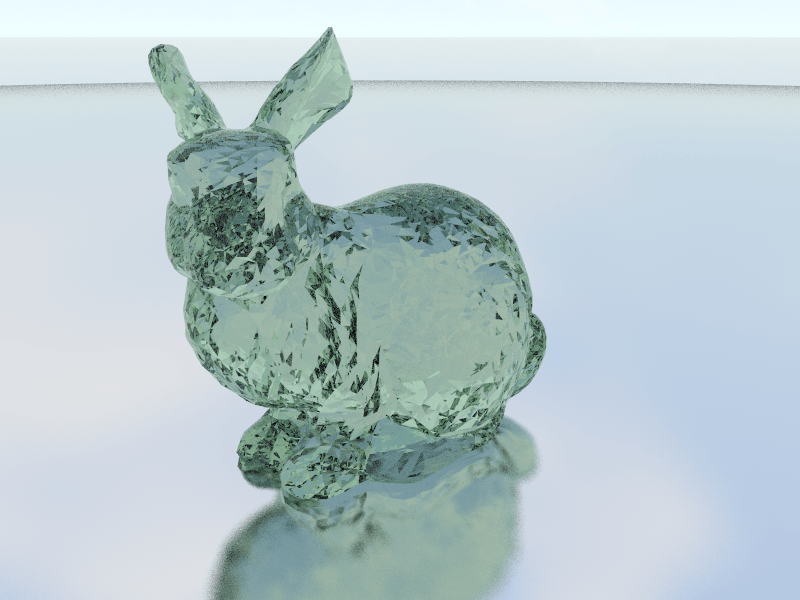

# scaling-potato

Ray tracing on CPU 🎥

Inspired by Ray Tracing in One Weekend Series: https://raytracing.github.io/

## Features

✅ = Functional, 🔨 = Work in progress, 🎯 = Planned

- ✅ Triangle meshes (OBJ format)
- ✅ Materials: Lambert, Metal, Dielectric, Emissive
- ✅ Image textures (TGA format)
- ✅ Bounding volume hierarchy
- ✅ Multithreaded rendering
- 🔨 Normal mapping
- 🎯 Scattering volumes
- 🎯 SIMD

